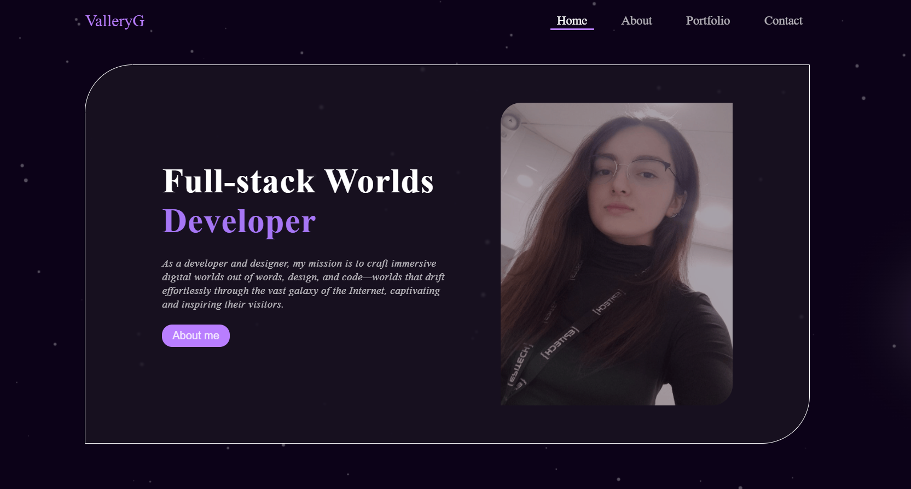

# ValleryG Portfolio (Prototype)

This is a **prototype** of my personal portfolio website, built to showcase my profile, learning journey, and selected projects.

The main goal of this prototype is to present my skills and projects developed during my training at Web@cadémie and beyond. It is currently deployed and accessible online.

## ⚠️ Disclaimer

> This is **not** the final version.  
> It is a **work-in-progress prototype** used for training, experimentation, and presentation purposes.

## 📷 Screenshot

## 🛠 Technologies Used

- **HTML5 / CSS3 / SCSS** — for clean structure and modern styling  
- **JavaScript (ES6+) + Babel** — for animation, tab logic, slider, and canvas effects  
- **PHP** — used to host the main page structure and support dynamic logic  

## ✨ Features

- Flat design & custom styling
- Animated sections (typed text, cursor lighting, floating dots)
- Interactive project showcase (expand/collapse logic)
- Custom hobby slider with smooth transitions
- Light/dark tones with clean contrast
- Contact form + downloadable CV

## 🧠 Author

Valeria GIRTIE

Visit my live portfolio 👉 [http://vallery.rf.gd/portfolio/index.php](http://vallery.rf.gd/portfolio/index.php)
